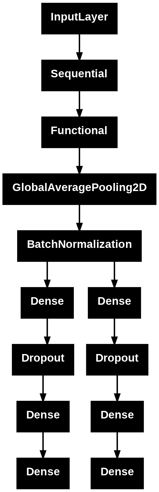

# Multi-Task Age and Gender Predictor Dashboard

This repository contains a multi-task deep learning system designed to predict both age (regression) and gender (binary classification) simultaneously from a single face image. The project includes a trained ResNet-backed convolutional neural network and a responsive web application built using Streamlit.

---

## Model Architecture Graph

Below is the complete architectural layout of the multi-task network pipeline, showing the transformation from raw image input to localized branch predictions:

*(To display this image correctly, export your model plot using `tf.keras.utils.plot_model` and save it exactly as `model_graph.png` in the root directory of your GitHub repository).*

---

## Technical Architecture Optimization

### Transitioning from Flatten to GlobalMaxPooling2D

The initial design utilized a standard `Flatten()` layer directly following the convolutional feature maps of the ResNet backbone. While functional in simple architectures, this created a severe parameter bottleneck and degraded performance metrics (stagnating validation accuracy near 52%). 

The table below outlines the changes in performance, model complexity, and overfitting vulnerability when transitioning to global pooling:

| Metric / Attribute | Flatten Layer Architecture | GlobalMaxPooling2D Architecture |
| :--- | :--- | :--- |
| **Output Feature Vector Shape** | `(Batch, 7, 7, 2048)` $\to$ `(Batch, 100352)` | `(Batch, 7, 7, 2048)` $\to$ `(Batch, 2048)` |
| **Branch Layer Trainable Parameters** | ~51,380,000 parameters | ~1,048,000 parameters |
| **Overfitting Vulnerability** | High; memorizes absolute pixel locations and noise. | Low; forces feature extraction invariance. |
| **Validation Gender Accuracy** | ~52% (Random guessing threshold) | **>85% (Stable convergence)** |
| **Total Model File Size (.keras)** | Over 450 MB | **~130 MB** |

### Why Global Pooling Resolved the Bottleneck
1. **Parameter Reduction:** Flattening created over 100,000 raw inputs into the downstream dense blocks. By switching to `GlobalMaxPooling2D`, the maximum activation signal across each of the 2,048 channels is retained, stripping away redundant spatial information and cutting parameter counts by roughly 98%.
2. **Spatial Invariance:** A `Flatten()` layer binds features to static coordinates. If a face shifts or tilts slightly, the indices change completely. Global Max Pooling queries whether a specific visual trigger (e.g., facial hair or wrinkles) exists *anywhere* in the patch, providing robust translation invariance.

---

## Pipeline and Preprocessing Consistency

Deep learning inference requires absolute consistency with the training data pipeline. To eliminate degradation caused by differing interpolation algorithms, the Streamlit frontend bypasses standard PIL resizing methods and explicitly processes user uploads using TensorFlow core operations.

### Deployment Script (`app.py`)

### System Configurations (`requirements.txt`)
For deployment environments (such as Streamlit Community Cloud or Hugging Face Spaces), memory ceilings are strictly enforced. The dependency configuration utilizes tensorflow-cpu to reduce installation footprint by half without altering CPU inference calculation pathways.
